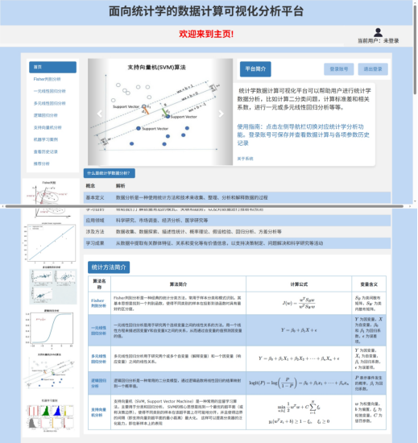

<div align="center">

# 📊 基于统计学的数据计算与可视化分析平台 (VSCP)

**2024中国大学生计算机应用能力大赛 获奖作品**

[](https://www.python.org/)
[](https://scikit-learn.org/)
[](https://redis.io/)
[](https://milvus.io/)
[](https://www.mongodb.com/)

</div>

---

## 💡 项目简介

**基于统计学的数据计算与可视化分析平台** (Visual Statistical Computation Platform) 旨在通过深度结合经典统计学方法与现代机器学习算法，构建一个集**数据分析**、**模型计算过程可视化**以及**个性化学习推荐**于一体的智能辅助系统。

本项目能够帮助学生直观理解抽象的统计理论、轻松完成题目求解，同时也能为科研人员提供强大的数据处理与决策支持，实现“教-学-研”赋能与数字化智慧转型。

## ✨ 核心特性

- 📈 **丰富的统计与机器学习模型**：支持各种核心算法，包含且不限于：
  - 线性回归 (Linear Regression) 与多元线性回归 (MLR)
  - 逻辑回归 (Logistic Regression)
  - 判别分析 (Fisher Discriminant)
  - 支持向量机 (SVM)
  - 基于树的模型：决策树 (Decision Tree)、随机森林 (Random Forest)、梯度提升机 (GBM) 等。
- 📊 **深度可视化与可解释性**：告别枯燥的数字！通过 `Chart.js` 和 `Plotly` 进行数据分布和模型预测边界的三维图形化展示，并结合 `MathJax` 将抽象的数学公式/计算过程直观呈现。
- ⚡ **高性能异步处理架构**：面对分析海量数据时的算力瓶颈，设计了基于 **Redis** 的任务队列与后台 `worker.py` 分布式处理架构，保障前端界面的高并发响应与流畅度。
- 🧠 **大模型与向量库驱动的个性推荐**：基于 **Milvus** 向量数据库做数据集 Embedding 匹配，分析用户的分析行为与特征，并生成高质量的个性化学习建议。混合 **MongoDB** 管理用户偏好数据，记录完整的历史探索轨迹。

## 🛠️ 技术栈

### 💻 后端开发
- **核心语言**: Python 3
- **数据科学与机器学习**: `scikit-learn`, `pandas`, `numpy`
- **数据库组件**:
  - `MySQL`: 存储关系型数据与核心账号信息
  - `MongoDB` (`pymongo`): 存储非结构化数据，如历史分析记录和用户偏好 (User Preferences)
  - `Milvus` (`pymilvus`): 强大的 AI 向量数据库，用于计算和存储特征向量与相似度检索
  - `Redis` (`redis-py`): 处理分布式锁管理缓存 (`setex`) 驱动异步后台分析队列

### 🖥️ 前端展示
- **核心前端**: HTML5, CSS3, JavaScript
- **UI 框架**: `Bootstrap` 类库
- **数据可视化组件**: `Chart.js`, `plotly.js`
- **公式排版渲染**: `MathJax`

## 🚀 快速启动

### 1. 环境依赖
确保本机系统已安装 Python 3，同时已经安装并配置好以下中间件服务并默认端口运行：
- MySQL (3306)
- MongoDB (27017)
- Redis (6379)
- Milvus (19530)

### 2. 克隆项目与安装库

```bash
git clone https://github.com/WangXianan456/2024_VSCPplus.git
cd 2024_VSCPplus
# 建议在虚拟环境中安装依赖
pip install -r requirements.txt
```
*(注：如缺少 requirements.txt，请手动安装 `scikit-learn`, `redis`, `pymongo`, `pymilvus` 等库)*

### 3. 运行平台

平台核心采取异步队列机制，需同时启动主服务端与后台处理进程：

```bash
# 启动后台任务分发进程 (执行推荐与耗时预测机制)
python worker.py

# 在另一个终端启动 Web 服务主程序 
python calculator.py
```

## 📸 系统截图



## 📝 证书与开源协议
Copyright © 2024. 本作品为竞赛成果，未经授权不可用于商业目的。
